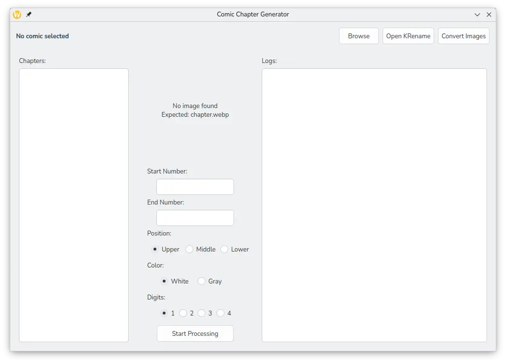

# Comic Chapter Generator GUI

## Description

This application provides a graphical interface to automate:
- Converting images to WebP format.
- Generating numbered covers for chapters.
- Creating CBZ files for comic chapters.



## Features

- Intuitive graphical interface.
- Batch processing.
- Automatic image optimization.
- Multiple format support.
- Integrated logging system.


## Requirements

- Python 3.x
- PyQt5
- pyvips
- "Old London" font (located in ~/.local/bin/)

## Usage

1. Run `gen_cbz_gui.py` to open the interface.
2. Select the comic directory.
3. Configure the desired parameters.
4. Start processing.

### Main Components

#### gen_cbz_gui.py

Main graphical interface for comic processing. Features:
- Working directory selection.
- Chapter image preview.
- Chapter numbering configuration.
- Text position and color adjustment.
- WebP image conversion.
- Process monitoring through logs.

#### gen_cbz.py

Core engine for chapter processing. Capabilities:
- Adding chapter numbers to covers.
- Font and text style customization.
- Support for decimal chapters (.5).
- CBZ file generation.
- Automatic cleanup of temporary directories.

#### convert_img.py

Image optimization utility:
- Batch conversion to WebP format.
- File size optimization.
- Image quality preservation.
- Reduction statistics reporting.


## Configuration Options

#### Text Position
- Top
- Middle
- Bottom

#### Text Color
- White
- Gray

## Installation

1. Clone this repository.
2. Install dependencies:
```bash
pip install PyQt5 pyvips
```
3. Copy the "Old London" font to ~/.local/bin/.
4. Make scripts executable.

## Additional Features

- KRename integration.
- Cover preview.
- Support for half chapters (e.g., 1.5).
- Real-time process monitoring.


## Important Notes

- A `chapter.webp` file is required in the working directory as a cover template. The size is 1500px*2121px.
- "OldLondon.ttf" font must be present in `~/.local/bin/`.
- Auxiliary scripts must be located in `~/.local/bin/`.

## Important Directory Naming Convention

The script currently only works with folders (directories) and requires a specific naming pattern:

### Valid folder name patterns:
- `Chapter 1`
- `Chapter 01`
- `Chapter 001`
- `Chapter 0001`

### Examples:
```
Working Directory/
├── chapter.webp
├── Chapter 1/        ✓ Valid
├── Chapter 01/       ✓ Valid
├── Chapter 001/      ✓ Valid
├── Chapter 0001/     ✓ Valid
├── Chapter 1.5/      ✓ Valid (for half chapters)
├── Ch. 1/            ✗ Invalid
├── Chapter-1/        ✗ Invalid
├── 1/               ✗ Invalid
└── ...
```

## Limitations

- The script currently works only with folders, not individual files.
- Folder names must strictly follow the pattern "Chapter X" where X is the number.
- The numbering pattern (e.g., “Chapter 001”) must be defined from the beginning, as it does not work if the digits are incremented automatically (e.g., “Chapter 1, Chapter 10, Chapter 100”).
- Any deviation from this naming convention may cause errors or unexpected behavior.
- The space between "Chapter" and the number is required.
- Half chapters must follow the same pattern with ".5" (e.g., "Chapter 1.5").

## Tips

- Ensure consistency in the number of digits used across all chapter folders.
- When in doubt, use the standard "Chapter XX" format.

## Output

The script will generate:
- CBZ files for each chapter.
- Automatically numbered covers.
- Process logs in the interface.

## Workflow

1. Select your comic's working directory.
2. Use KRename if folder renaming is needed.
3. Convert images to WebP format if necessary.
4. Configure chapter numbering parameters.
5. Start the processing to generate CBZ files.

## Error Handling

- Validates working directory selection.
- Checks for required files and folders.
- Provides feedback through the logging system.
- Maintains original folders if CBZ creation fails.

## Technical Details

### Threads
- Uses QThread for background processing.
- Prevents UI freezing during operations.
- Real-time output updates.

### Image Processing
- Supports WebP conversion.
- Custom cover generation with ImageMagick.
- Configurable text positioning and styling.

### File Operations
- Automatic ZIP compression.
- Directory cleanup after successful CBZ creation.
- Preservation of original files on failure.

## Contributions

Contributions are welcome. Please ensure you test your changes before submitting a pull request.

## Troubleshooting

Common issues:
- Missing `chapter.webp`: Ensure cover template exists.
- Font errors: Check OldLondon.ttf installation.
- Permission issues: Verify script permissions.
- KRename not found: Install KRename package.

## Acknowledgments

- PyQt5 for the GUI framework.
- ImageMagick for image processing.
- Open-source community


---

Feel free to report issues or suggest improvements through the issue tracker.
